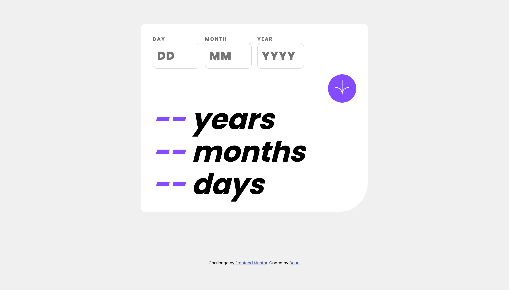
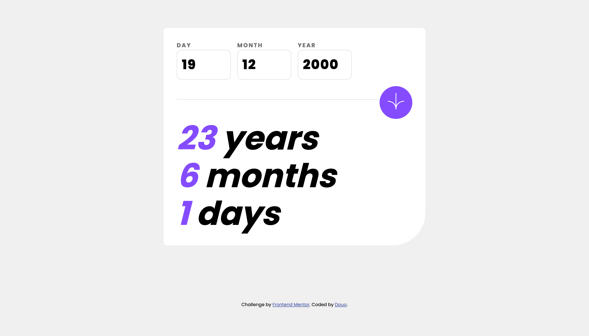
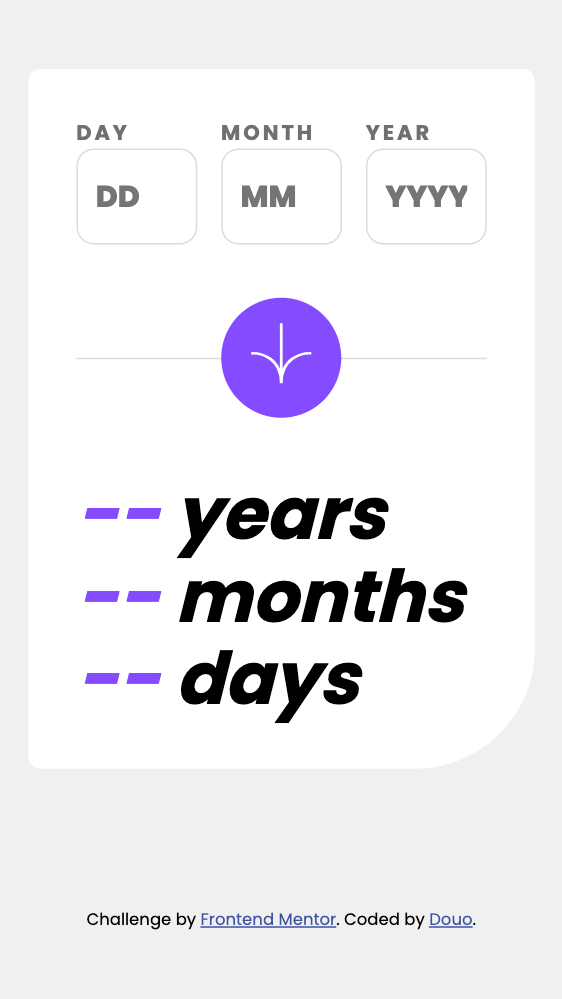

# Frontend Mentor - Age calculator app solution

This is a solution to the [Age calculator app challenge on Frontend Mentor](https://www.frontendmentor.io/challenges/age-calculator-app-dF9DFFpj-Q). Frontend Mentor challenges help you improve your coding skills by building realistic projects. 

## Table of contents

- [Overview](#overview)
  - [The challenge](#the-challenge)
  - [Screenshot](#screenshot)
  - [Links](#links)
- [My process](#my-process)
  - [Built with](#built-with)
  - [What I learned](#what-i-learned)
  - [Continued development](#continued-development)
  - [Useful resources](#useful-resources)
- [Author](#author)

## Overview

### The challenge

Users should be able to:

- View an age in years, months, and days after submitting a valid date through the form
- Receive validation errors if:
  - Any field is empty when the form is submitted
  - The day number is not between 1-31
  - The month number is not between 1-12
  - The year is in the future
  - The date is invalid e.g. 31/04/1991 (there are 30 days in April)
- View the optimal layout for the interface depending on their device's screen size
- See hover and focus states for all interactive elements on the page
- **Bonus**: See the age numbers animate to their final number when the form is submitted

### Screenshot

<h3>Desktop screenshot</h3>

<h3>Mobile screenshot</h3>

### Links

- Live Site URL: [live url](https://douoo.github.io/frontendmentor_challenges/age-calculator-app-main/)
- Solution URL: [src-code](https://github.com/Douoo/frontendmentor_challenges/tree/main/age-calculator-app-main)

## My process

### Built with

- Semantic HTML5 markup
- CSS custom properties
- CSS Grid
- Mobile-first workflow
- Vanilla JS

### What I learned

This was a simple yet tricky project. I started off the wrong foot without really considering how I will do the validation at first and only focused on getting the design right. But that cost me a lot of time in finishing the project as my mind just kept throwing different types of ways on how I could do the validation. All in all, I wanted to write a code that was reusable and short but it became tangled up at some moment as the usecase was not how I initially intended it to be. At the end, I just went with the flow as I was a bit tired and I'm happy with the end product although interms of optmization I still think my code could be optimised. 

### Continued development

This project was simple but it reminded me that I need to learn more to make my experience in vanilla JS solid. Especially on multiple form field types such as the ones in this project.

## Author

- Frontend Mentor - [@Douoo](https://www.frontendmentor.io/profile/douoo)
- Twitter - [@Douoo](https://twitter.com/Douoo_B)
- Instagram - [@douoo](https://www.instagram.com/douooo/)

