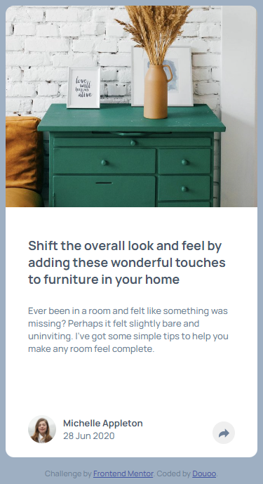
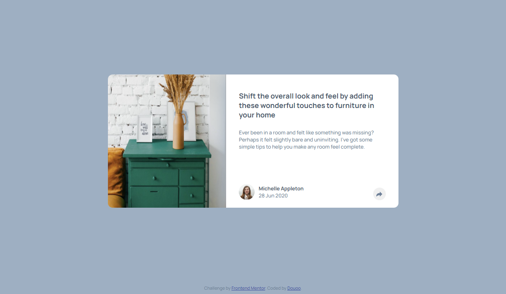

# Frontend Mentor - Article preview component solution

This is a solution to the [Article preview component challenge on Frontend Mentor](https://www.frontendmentor.io/challenges/article-preview-component-dYBN_pYFT). Frontend Mentor challenges help you improve your coding skills by building realistic projects. 

## Table of contents

- [Overview](#overview)
  - [The challenge](#the-challenge)
  - [Screenshot](#screenshot)
  - [Links](#links)
- [My process](#my-process)
  - [Built with](#built-with)
  - [What I learned](#what-i-learned)
  - [Useful resources](#useful-resources)
- [Author](#author)

## Overview

### The challenge

Users should be able to:

- View the optimal layout for the component depending on their device's screen size
- See the social media share links when they click the share icon

### Screenshot

<h3>Mobile view</h3>

<h3>Web view</h3>

### Links
- Live Site URL: [Live site DEMO](https://douoo.github.io/frontendmentor_challenges/article-preview-component-master/)
- Solution URL: [Source code](https://github.com/Douoo/frontendmentor_challenges/tree/main/article-preview-component-master)
## My process

### Built with

- Semantic HTML5 markup
- CSS custom properties
- Flexbox
- CSS Grid
- Mobile-first workflow

### What I learned

This was a really intersting challenge. The UI code was not as hard as I thought it would be. I learned how to make a toggle callout and it was a fun one. I have attached the resource I learned from below.

### Useful resources

- [Making a toggle pop](https://codepen.io/moniqueward/pen/yNGQBz) - This helped really helped me in learning how to make a toggle callout with a triangle notch on it. It's a straightforward code. If you're also looking to build a toggler, have a look. It was a huge help for me.

## Author

- Frontend Mentor - [@Douoo](https://www.frontendmentor.io/profile/douoo)
- Instagram - [@Douoo](https://www.instagram.com/douooo/)
