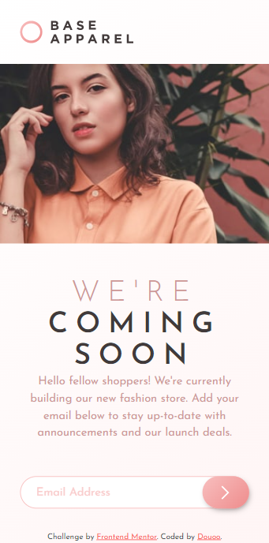
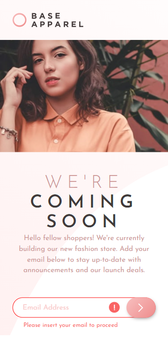
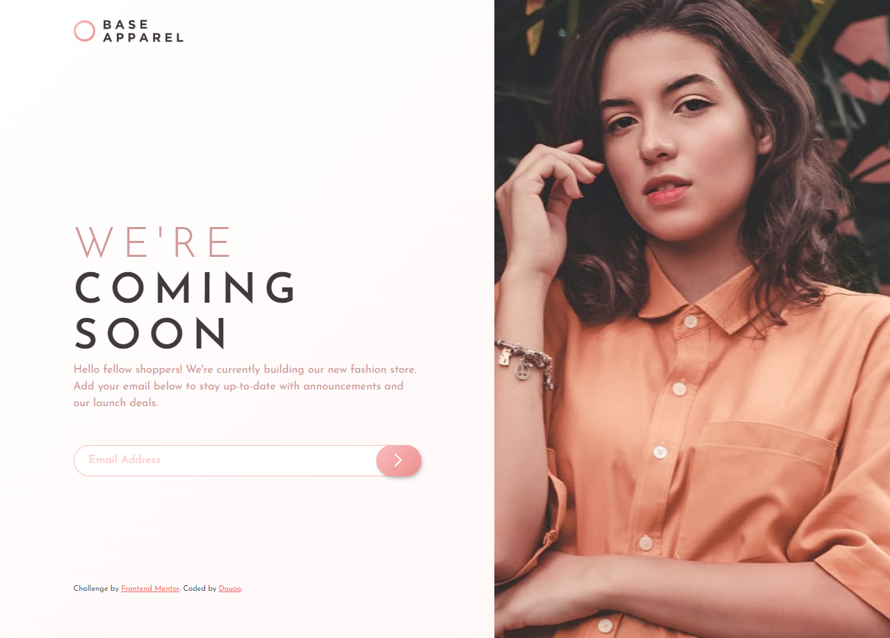
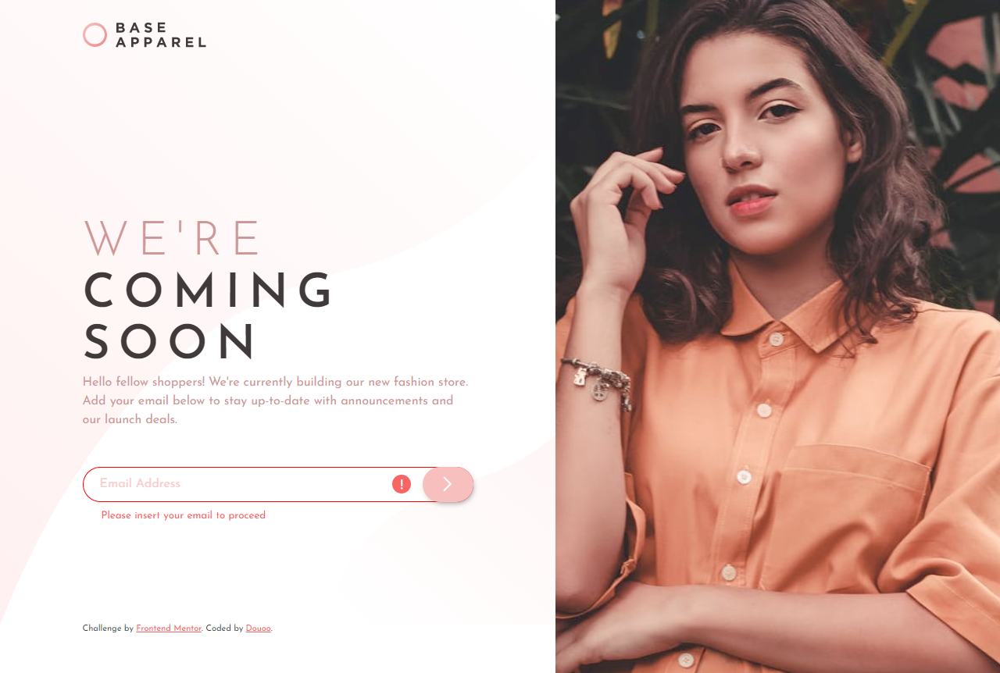

# Frontend Mentor - Base Apparel coming soon page solution

This is a solution to the [Base Apparel coming soon page challenge on Frontend Mentor](https://www.frontendmentor.io/challenges/base-apparel-coming-soon-page-5d46b47f8db8a7063f9331a0). Frontend Mentor challenges help you improve your coding skills by building realistic projects. 

## Table of contents

- [Overview](#overview)
  - [The challenge](#the-challenge)
  - [Screenshot](#screenshot)
  - [Links](#links)
- [My process](#my-process)
  - [Built with](#built-with)
  - [What I learned](#what-i-learned)
  - [Continued development](#continued-development)
  - [Useful resources](#useful-resources)
- [Author](#author)
- [Acknowledgments](#acknowledgments)

## Overview

### The challenge

Users should be able to:

- View the optimal layout for the site depending on their device's screen size
- See hover states for all interactive elements on the page
- Receive an error message when the `form` is submitted if:
  - The `input` field is empty
  - The email address is not formatted correctly

### Screenshot

### Links

- Live Site URL: [Live site DEMO](https://douoo.github.io/frontendmentor_challenges/base-apparel-coming-soon-master/)
- Solution URL: [Source code](https://github.com/Douoo/frontendmentor_challenges/tree/main/base-apparel-coming-soon-master)

## My process

### Built with

- Semantic HTML5 markup
- CSS custom properties
- Flexbox
- CSS Grid
- Mobile-first workflow

### What I learned
With this challenge I learned how to do email validation, custom styling, and practice my CSS grid skill. I still can't really write my own RegEx, but luckly there's a bunch of expressions out there available for me to use 😅.
One of the things I had to spend time on was again naming and ordering my CSS classes in a manner that's descriptive and organized.

### Continued development

This was a great design to build for a coming soon landing page, and I might prefer to use this on some projects as well.

### Useful resources

- [CSS grid](https://css-tricks.com/snippets/css/complete-guide-grid/) - had to check my go-to CSS grid resource (very helpful). I usually tend to use CSS flex but I love how grid provides more flexible and verstile features to work with.
- [CSS grid video tutorial](https://www.youtube.com/watch?v=8QSqwbSztnA) - if you're the kind of person who prefers to watch a video rather than read an article. I recommend you watch Kevin Powell's video on getting started with grid. Its simple, easy and to the point.

## Author

- Frontend Mentor - [@Douoo](https://www.frontendmentor.io/profile/douoo)
- Instagram - [@Douoo](https://www.instagram.com/douooo/)

