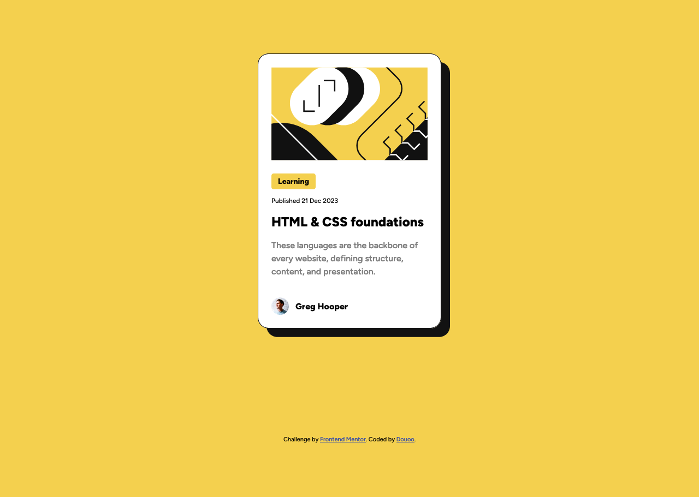
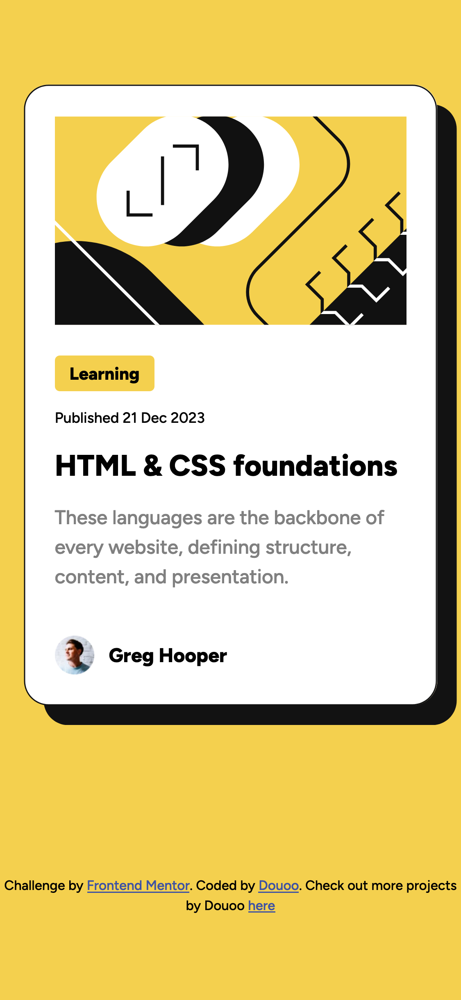

# Frontend Mentor - Blog preview card solution

This is a solution to the [Blog preview card challenge on Frontend Mentor](https://www.frontendmentor.io/challenges/blog-preview-card-ckPaj01IcS). Frontend Mentor challenges help you improve your coding skills by building realistic projects. 

## Table of contents

- [Overview](#overview)
  - [The challenge](#the-challenge)
  - [Screenshot](#screenshot)
  - [Links](#links)
- [My process](#my-process)
  - [Built with](#built-with)
  - [What I learned](#what-i-learned)
  - [Continued development](#continued-development)
  - [Useful resources](#useful-resources)
- [Author](#author)
- [Acknowledgments](#acknowledgments)

## Overview

### The challenge

Users should be able to:

- See hover and focus states for all interactive elements on the page

### Screenshot

### Links

- Solution URL: [Live Site](https://douoo.github.io/frontendmentor_challenges/blog-preview-card-main/)
- Live Site URL: [Solution url](https://github.com/Douoo/frontendmentor_challenges/tree/main/blog-preview-card-main)

## My process

### Built with

- Semantic HTML5 markup
- CSS custom properties
- Flexbox
- CSS Grid
- Mobile-first workflow

## Author

Lets connect

- GitHub Profile - [@Douoo](https://github.com/Douoo) 
- Frontend Mentor - [@Douoo](https://www.frontendmentor.io/profile/Douoo)
- Twitter - [@Douoo_B](https://twitter.com/Douoo_B)

