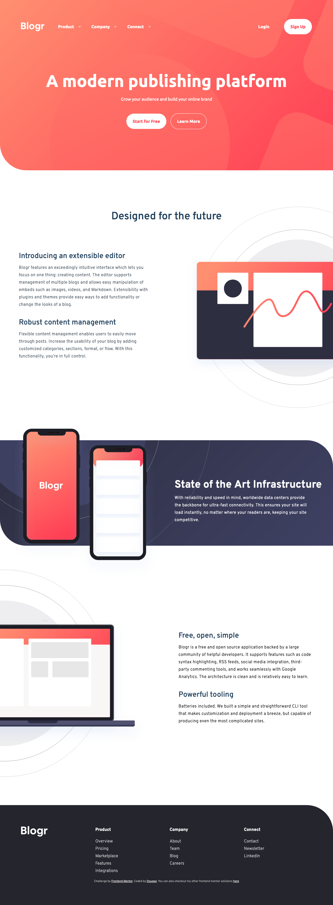

# Frontend Mentor - Blogr landing page solution

This is a solution to the [Blogr landing page challenge on Frontend Mentor](https://www.frontendmentor.io/challenges/blogr-landing-page-EX2RLAApP). Frontend Mentor challenges help you improve your coding skills by building realistic projects. 

## Table of contents

- [Overview](#overview)
  - [The challenge](#the-challenge)
  - [Screenshot](#screenshot)
  - [Links](#links)
- [My process](#my-process)
  - [Built with](#built-with)
  - [What I learned](#what-i-learned)
  - [Continued development](#continued-development)
  - [Useful resources](#useful-resources)
- [Author](#author)
- [Acknowledgments](#acknowledgments)

## Overview

### The challenge

Users should be able to:

- View the optimal layout for the site depending on their device's screen size
- See hover states for all interactive elements on the page

### Screenshot

### Links

- Solution URL: [Link to solution URL here](https://github.com/Douoo/frontendmentor_challenges/tree/main/blogr-landing-page-main)
- Live Site URL: [Link to live site](https://douoo.github.io/frontendmentor_challenges/blogr-landing-page-main/)

## My process

### Built with

- Semantic HTML5 markup
- CSS custom properties
- Flexbox
- CSS Grid
- Mobile-first workflow

### What I learned

I think what I learned in this challenge is, a good UI design should make sense to the developer. I found myself questioning many of the design choices here, and the conclusion I came to was that, this was a challenge that's made to challenge the developer, namely when it comes to patience.

The good thing was, I'm pleased with the nav and dropdowns I built here, which were different than the ones I did before. Much thanks to Kevin Powell for his tutorials!

### Continued development

Probably none!

### Useful resources

- [Kevin Powell's FEM tutorial series](https://youtube.com/playlist?list=PL4-IK0AVhVjNDRHoXGort7sDWcna8cGPA) - This helped me in structuring my code, using CUBE CSS, and also building my mobile nav
- [Alexander Morse's PayAPI solution repo](https://github.com/Sakeran/fem-payapi-mpa) - I came across Alexander's solution on FEM and really liked what he did with his page

## Author

- Frontend Mentor - [@Douoo](https://www.frontendmentor.io/profile/Douoo)
- Twitter - [@Douoo_B](https://twitter.com/Douoo_B)
- Instagram - [@Douoo](https://www.instagram.com/douooo/)

## Acknowledgments
Kevin Powell