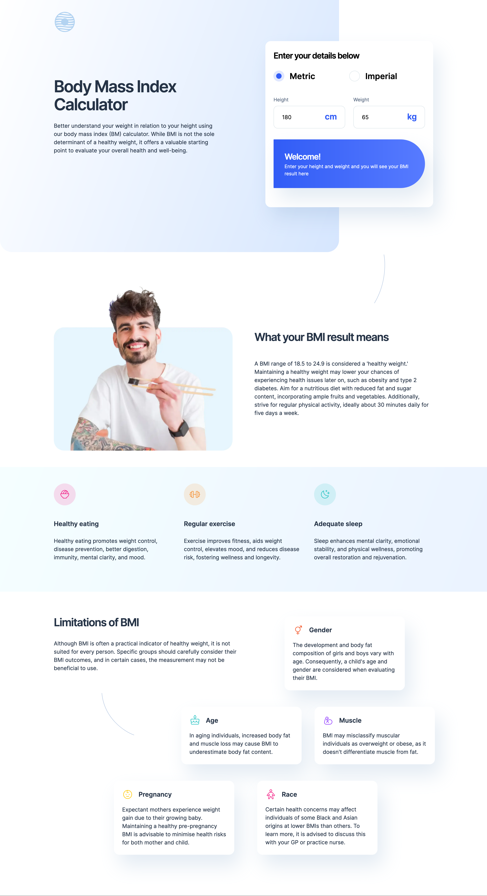
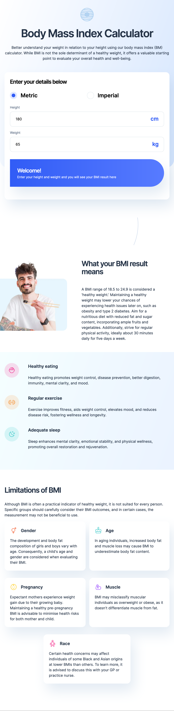

# Frontend Mentor - Body Mass Index Calculator solution

This is a solution to the [Body Mass Index Calculator challenge on Frontend Mentor](https://www.frontendmentor.io/challenges/body-mass-index-calculator-brrBkfSz1T). Frontend Mentor challenges help you improve your coding skills by building realistic projects. 

## Table of contents

- [Overview](#overview)
  - [The challenge](#the-challenge)
  - [Screenshot](#screenshot)
  - [Links](#links)
- [My process](#my-process)
  - [Built with](#built-with)
  - [What I learned](#what-i-learned)
  - [Continued development](#continued-development)
  - [Useful resources](#useful-resources)
- [Author](#author)
- [Acknowledgments](#acknowledgments)

## Overview

### The challenge

Users should be able to:

- Select whether they want to use metric or imperial units
- Enter their height and weight
- See their BMI result, with their weight classification and healthy weight range
- View the optimal layout for the interface depending on their device's screen size
- See hover and focus states for all interactive elements on the page

### Screenshot

### Links

- Live Site URL: [Live Site](https://douoo.github.io/frontendmentor_challenges/bmi-calculator/)
- Solution URL: [Solution url](https://github.com/Douoo/frontendmentor_challenges/tree/main/bmi-calculator)

## My process

### Built with

- Semantic HTML5 markup
- CSS custom properties
- Flexbox
- CSS Grid
- Mobile-first workflow
- VanillaJS

### What I learned

This was a tricky challenge both interms of layout design and Javascript arrangement. I felt so tired to do this project and felt low on energy. I have to push and motivate myself to get this challenge done 😅. Anyways, eventhough this project was kind of a noobie it took me a long time to complete it and...Oh my God, its done.

The layout organization at the end of the page made me think how I could implement it and get it visually close to the design. I tried to do that to my best. In doing so, I flexed my CSS grid area expertise. I can't say my class naming is the best but I think it is good enough for now (I need a peace of mind 😮‍💨).

Through the project, I learned how to make a custom radio button and rendering optional content via JS. 

### Continued development

Building on this, I will prepare myself to start using ReactJS more and more for the coming challenges.

## Author

If you get any issue with these source codes, you can always open an issue and will check it out. Want to have a discussion with me on a project? You can contact me on X(formerly known as twitter)

- GitHub Profile - [@Douoo](https://github.com/Douoo) 
- Frontend Mentor - [@Douoo](https://www.frontendmentor.io/profile/Douoo)
- Twitter - [@Douoo_B](https://twitter.com/Douoo_B)

## Acknowledgments

This tutorial by [Stephanie Eckles](https://moderncss.dev/pure-css-custom-styled-radio-buttons/) provided me with a way on how I can style my radio button. Its straight forward and easy to understand 👌🏽.
