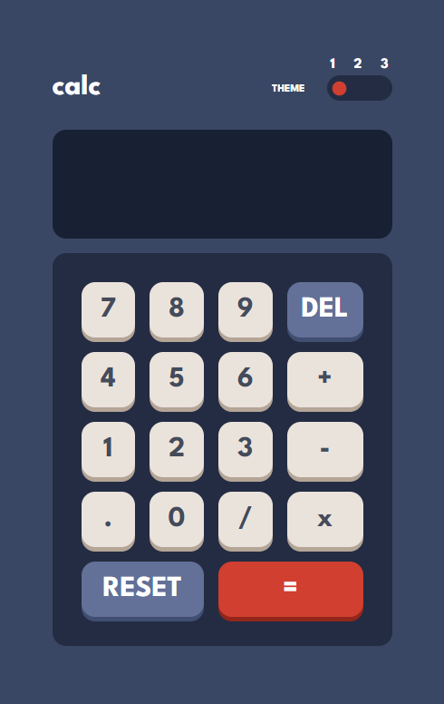
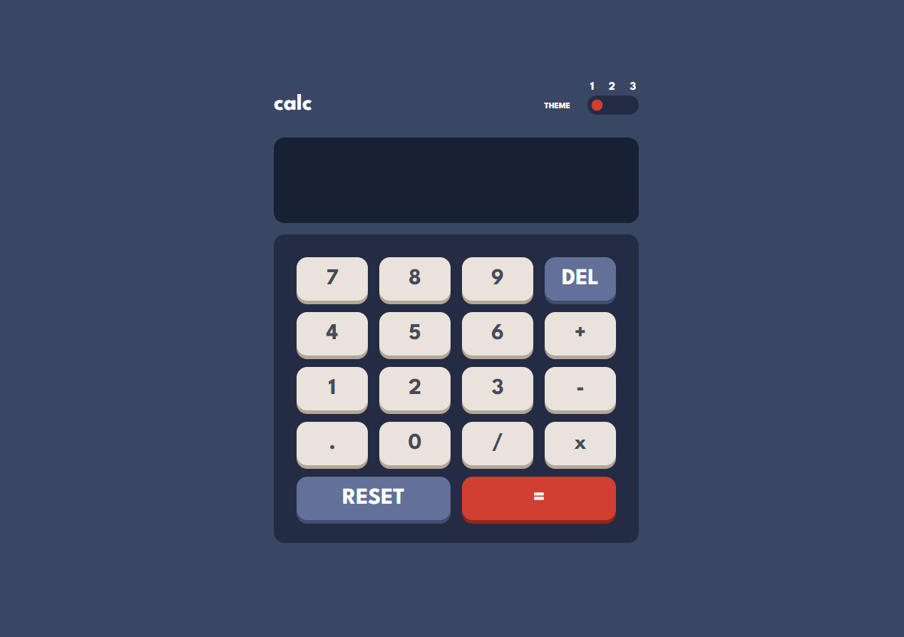

# Calculator App

This is a solution to the [Calculator app challenge on Frontend Mentor](https://www.frontendmentor.io/challenges/calculator-app-9lteq5N29). Frontend Mentor challenges help you improve your coding skills by building realistic projects. 

## Table of contents

- [Overview](#overview)
  - [The challenge](#the-challenge)
  - [Screenshot](#screenshot)
  - [Links](#links)
- [My process](#my-process)
  - [Built with](#built-with)
  - [What I learned](#what-i-learned)
  - [Useful resources](#useful-resources)

## Overview

### The challenge

Users should be able to:

- See the size of the elements adjust based on their device's screen size
- Perform mathmatical operations like addition, subtraction, multiplication, and division
- Adjust the color theme based on their preference
- Have their initial theme preference checked using `prefers-color-scheme` and have any additional changes saved in the browser

### Screenshot
The default theme of the website is based on the current user OS theme choice. If its dark, then the theme will be set to dark, if its light, light theme will be applied. However, if the user is using a custom theme, it will go with no-preference-theme (the third theme).

Here are the previews(screenshots) of the themes.
<h1>Mobile view - dark and light</h1>

  
  

### Links

- Live Site URL visit: [Test it LIVE](https://douoo.github.io/calculator-app)
- SRC code: [Check the code](https://github.com/Douoo/calculator-app)

## My process

### Built with

- Semantic HTML5 markup
- CSS custom properties
- Flexbox
- CSS Grid
- Mobile-first workflow
- Custom theme selector with prefers-color-theme
- Vanilla JavaScript

### What I learned

This is my first time building a calculator app but I have to say, I learned lots of useful css features like css grid, prefers-color-theme and building custom theme selector for your website. Moreover, I was able to practice my javascript skill like using JS classes. 
I learned the basics of CSS grid from the traversy media on youtube(link below). It helped me grasp the concept of CSS grids. Additional to that, I also learned how we can use prefers-color-scheme for theme setup.

Summarizing what I learned, you can build this with any frontend language that you're comfortable with but you'll need to know the basics of css grid, and I also recommend you understand how to make a custom theme selector. Moreover, I recommend you be familiar with the use javascript OOP concept like using classes.

### Useful resources
- [CSS Grid Tutorial Video](https://www.youtube.com/watch?v=jV8B24rSN5o) - This is an amazing tutorial by travery media which helped me get a concrete basic understanding of css grid.
- [Usage of Prefers-color-theme](https://web.dev/prefers-color-scheme/) - This is an amazing article helped understand the historical background and theory of dark mode in addition to how to use the prefers-color-theme css feature. I'd recommend it to anyone still learning the prefers-color-scheme.
- [Build A Calculator With JavaScript Tutorial](https://www.youtube.com/watch?v=j59qQ7YWLxw) - Web Dev Simplified's calculator tutorial, this gave me a strong foundation for rebuilding my calculator app additionally reminding me to use a class based approach for certain devlopment approach.

## Author
If you found this repo to be helpful in any way feel free to give it a star. Its a very simple calculator website. You can find such frontend-mentor website. You can connect with me on 
- Frontend Mentor - [@Douoo](https://www.frontendmentor.io/profile/douoo)
- Instagram - [@Douooo](https://www.instagram.com/douooo)
- LinkedIn - [@Brooksew](https://www.linkedin.com/in/brooksewb)

