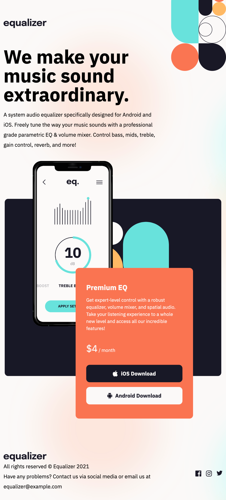

# Frontend Mentor - Equalizer landing page solution

This is a solution to the [Equalizer landing page challenge on Frontend Mentor](https://www.frontendmentor.io/challenges/equalizer-landing-page-7VJ4gp3DE). Frontend Mentor challenges help you improve your coding skills by building realistic projects. 

## Table of contents

- [Overview](#overview)
  - [The challenge](#the-challenge)
  - [Screenshot](#screenshot)
  - [Links](#links)
- [My process](#my-process)
  - [Built with](#built-with)
  - [What I learned](#what-i-learned)
- [Author](#author)

## Overview

### The challenge

Users should be able to:

- View the optimal layout depending on their device's screen size
- See hover states for interactive elements

### Screenshot

### Links

- Live Site URL: [Live Site](https://douoo.github.io/frontendmentor_challenges/equalizer-landing-page/)
- Solution URL: [Solution url](https://github.com/Douoo/frontendmentor_challenges/tree/main/equalizer-landing-page)

## My process

### Built with

- Semantic HTML5 markup
- CSS custom properties
- Flexbox
- CSS Grid
- Mobile-first workflow

### What I learned

Practiced my CSS layout skills. The project is simple but the diverse font and layout properties on different screen sizes made it a bit challenging to get the design straight. 

## Author

- GitHub Profile - [@Douoo](https://github.com/douoo) 
- Frontend Mentor - [@Douoo](https://www.frontendmentor.io/profile/Douoo)
- Twitter - [@Douoo_B](https://twitter.com/Douoo_B)

