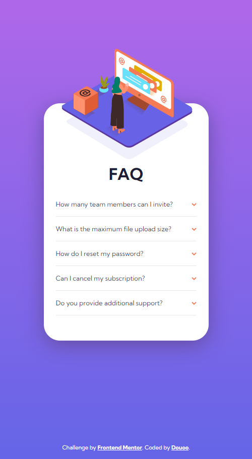

# Frontend Mentor - FAQ accordion card solution

This is a solution to the [FAQ accordion card challenge on Frontend Mentor](https://www.frontendmentor.io/challenges/faq-accordion-card-XlyjD0Oam). Frontend Mentor challenges help you improve your coding skills by building realistic projects. 

## Table of contents

- [Overview](#overview)
  - [The challenge](#the-challenge)
  - [Screenshot](#screenshot)
  - [Links](#links)
- [My process](#my-process)
  - [Built with](#built-with)
  - [What I learned](#what-i-learned)
  - [Continued development](#continued-development)
- [Author](#author)

## Overview

### The challenge

Users should be able to:

- View the optimal layout for the component depending on their device's screen size
- See hover states for all interactive elements on the page
- Hide/Show the answer to a question when the question is clicked

### Screenshot

<h3>Mobile Preview </h3>

<h3>Web Preview </h3>

### Links

- Live Site URL: [Live site DEMO](https://douoo.github.io/frontendmentor-challenges/faq-accordion-card-main)
- Solution URL: [Source code](https://github.com/douoo/frontendmentor-challenges/faq-accordion-card-main)
## My process

### Built with

- Semantic HTML5 markup
- CSS custom properties
- Flexbox
- CSS Grid
- Mobile-first workflow

### What I learned

I learned the basic usage of css transform functions. I used translate and rotate function for positioning the images. Other than these, I used basic css properties.

### Continued development

I used the transform function for aligning and positioning the image but still I came across a couple of problems when positioning the background image. It was a bit out of layout and therefore I hardcoded the length of my card bg image (to the left of the FAQ content), which is not really recommended to do. I will look for a better solution in the future.

## Author

- Frontend Mentor - [@Douoo](https://www.frontendmentor.io/profile/douoo)
- Instagram - [@Douoo](https://www.instagram.com/douooo/)
