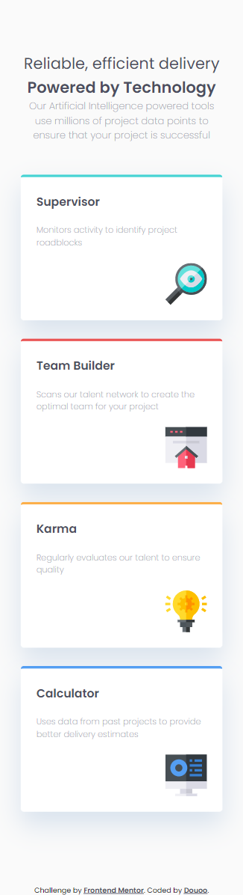
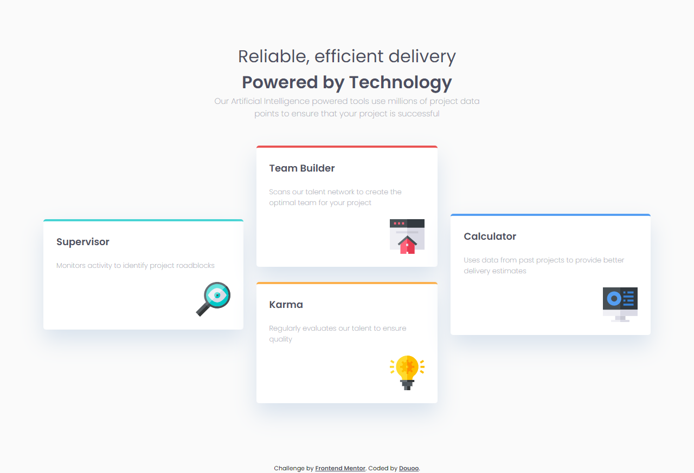

# Frontend Mentor - Four card feature section solution

This is a solution to the [Four card feature section challenge on Frontend Mentor](https://www.frontendmentor.io/challenges/four-card-feature-section-weK1eFYK). Frontend Mentor challenges help you improve your coding skills by building realistic projects. 

## Table of contents

- [Overview](#overview)
  - [The challenge](#the-challenge)
  - [Screenshot](#screenshot)
  - [Links](#links)
- [My process](#my-process)
  - [Built with](#built-with)
  - [What I learned](#what-i-learned)
- [Author](#author)

## Overview

### The challenge

Users should be able to:

- View the optimal layout for the site depending on their device's screen size

### Screenshot

<h3>Mobile View</h3>

<h3>Desktop View</h3>

### Links

- Live Site URL: [Live site DEMO](https://douoo.github.io/frontendmentor_challenges/four-card-feature-section-master/)
- Solution URL: [Source code](https://github.com/Douoo/frontendmentor_challenges/tree/main/four-card-feature-section-master)

## My process

### Built with

- Semantic HTML5 markup
- CSS custom properties
- Flexbox
- CSS Grid
- Mobile-first workflow

### What I learned

This challenge helped me practice my CSS flex skills.

## Author

- Frontend Mentor - [@Douoo](https://www.frontendmentor.io/profile/douoo)
- Instagram - [@Douoo](https://www.instagram.com/douooo/)
