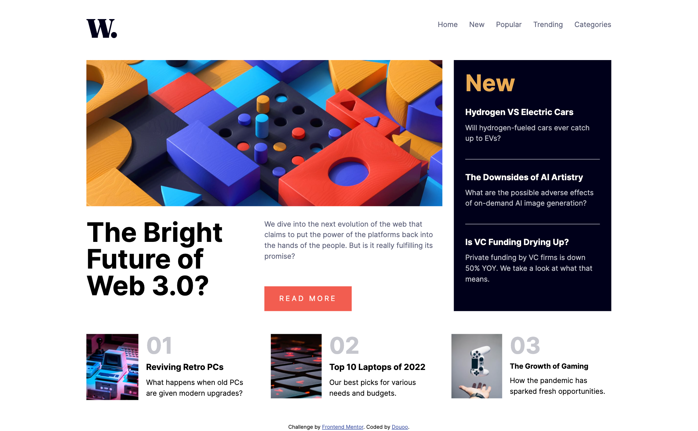
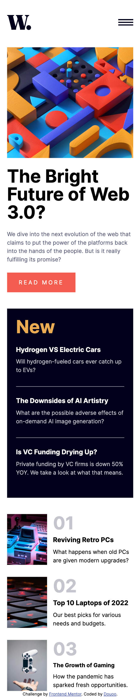

# Frontend Mentor - News homepage solution

This is a solution to the [News homepage challenge on Frontend Mentor](https://www.frontendmentor.io/challenges/news-homepage-H6SWTa1MFl). Frontend Mentor challenges help you improve your coding skills by building realistic projects. 

## Table of contents

- [Overview](#overview)
  - [The challenge](#the-challenge)
  - [Screenshot](#screenshot)
  - [Links](#links)
- [My process](#my-process)
  - [Built with](#built-with)
  - [What I learned](#what-i-learned)
  - [Continued development](#continued-development)
- [Author](#author)

## Overview

### The challenge

Users should be able to:

- View the optimal layout for the interface depending on their device's screen size
- See hover and focus states for all interactive elements on the page

### Screenshot

 
    
    

### Links

- Live Site URL: [Live site](https://douoo.github.io/frontendmentor_challenges/news-homepage-main/)
- Solution URL: [Source code](https://github.com/Douoo/frontendmentor_challenges/tree/main/news-homepage-main)

## My process

### Built with

- Semantic HTML5 markup
- CSS custom properties
- Flexbox
- CSS Grid
- Mobile-first workflow
- Vanilla JS

### What I learned

This was my first full single page project on frontend mentor (I usually did cards and components) and after finishing this challenge, I can say this was a good challenge. I have to say I got lost on naming my CSS classes the right way (I started off by deciding with the BEM naming convention but I dont I have done it the right, sorry 😅). All in all, I still wonder if I have done the navigation the right way. 

### Continued development

I'm planning on using ReactJS for upcoming projects but I thought I could use a bit more skill in developing more complex app using Semantic HTML and CSS first. I hope to use this project as a stepping stone for the coming projects.

## Author

- Frontend Mentor - [@Douoo](https://www.frontendmentor.io/profile/Douoo)
- Twitter - [@Douoo_B](https://twitter.com/Douoo_B)
- Instagram - [@Douoo](https://www.instagram.com/douooo/)

