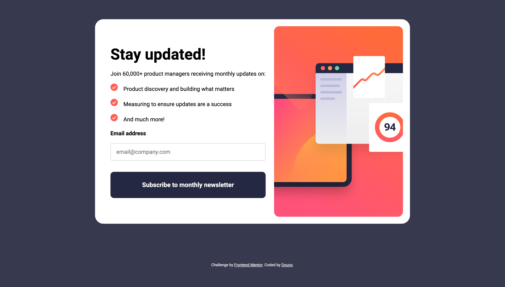
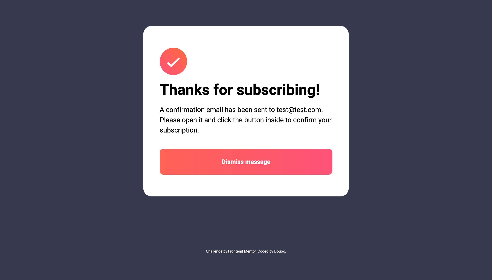
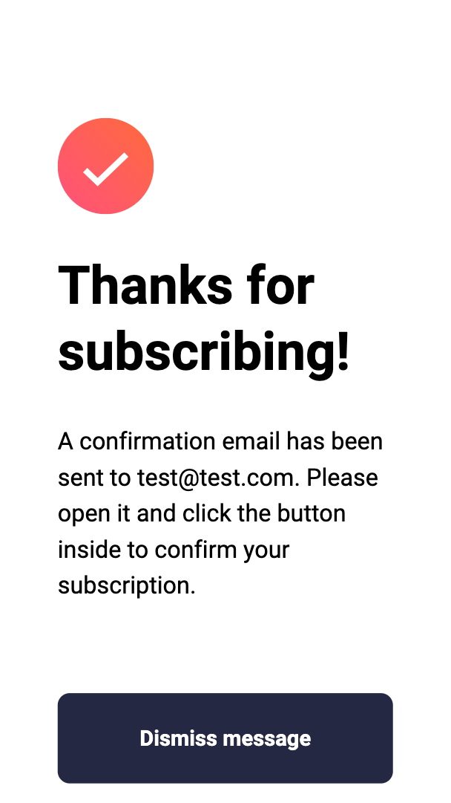

# Frontend Mentor - Newsletter sign-up form with success message solution

This is a solution to the [Newsletter sign-up form with success message challenge on Frontend Mentor](https://www.frontendmentor.io/challenges/newsletter-signup-form-with-success-message-3FC1AZbNrv). Frontend Mentor challenges help you improve your coding skills by building realistic projects. 

## Table of contents

- [Overview](#overview)
  - [The challenge](#the-challenge)
  - [Screenshot](#screenshot)
  - [Links](#links)
- [My process](#my-process)
  - [Built with](#built-with)
  - [What I learned](#what-i-learned)
  - [Continued development](#continued-development)
  - [Useful resources](#useful-resources)
- [Author](#author)
- [Acknowledgments](#acknowledgments)

## Overview

### The challenge

Users should be able to:

- Add their email and submit the form
- See a success message with their email after successfully submitting the form
- See form validation messages if:
  - The field is left empty
  - The email address is not formatted correctly
- View the optimal layout for the interface depending on their device's screen size
- See hover and focus states for all interactive elements on the page

### Screenshot





<div>
  
  
</div>


### Links

- Live Site URL: [Live site](https://douoo.github.io/frontendmentor_challenges/newsletter-sign-up-with-success-message-main/)
- Solution URL: [Source code](https://github.com/Douoo/frontendmentor_challenges/tree/main/newsletter-sign-up-with-success-message-main)

## My process

### Built with

- Semantic HTML5 markup
- CSS custom properties
- Flexbox
- CSS Grid
- Mobile-first workflow

### What I learned

 This project helped me revise how to add validation to a form using CSS and js altogether (using the :invalid CSS property).
```
.form-control input:not(:focus):invalid.error,
.form-control input:not(:focus):not(:placeholder-shown):invalid.error {
    background-color: hsla(var(--clr-primary-700-hsl), 0.2);
    border: 1px solid var(--clr-primary-700);
}
```

### Continued development

I hope to use this project as a warm up to develop on more complex app. I'm really excited to develop other projects as well but using framework like ReactJS.


### Useful resources

- [Take a look at this fantastic content on form validation by Bramus](https://www.bram.us/2021/01/28/form-validation-you-want-notfocusinvalid-not-invalid/) - This helped me add JS and CSS form validation the right way. I really liked the way that Bramus explained on how to do form validation and will use it going forward.

## Author

- Frontend Mentor - [@Douoo](https://www.frontendmentor.io/profile/Douoo)
- Twitter - [@Douoo_B](https://twitter.com/Douoo_B)
- Instagram - [@Douoo](https://www.instagram.com/douooo/)


## Acknowledgments

Big thanks to Bramus 👍🏽