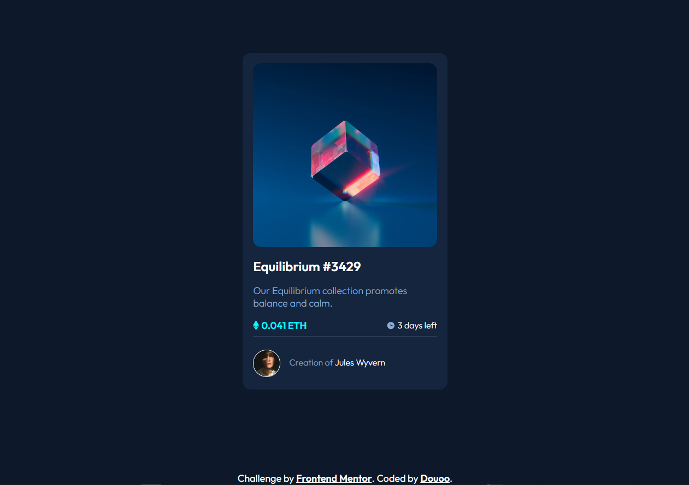

# Frontend Mentor - NFT preview card component solution

This is a solution to the [NFT preview card component challenge on Frontend Mentor](https://www.frontendmentor.io/challenges/nft-preview-card-component-SbdUL_w0U). Frontend Mentor challenges help you improve your coding skills by building realistic projects. 

## Table of contents

- [Overview](#overview)
  - [The challenge](#the-challenge)
  - [Screenshot](#screenshot)
  - [Links](#links)
- [My process](#my-process)
  - [Built with](#built-with)
  - [Continued development](#continued-development)
- [Author](#author)

## Overview

### The challenge

The challenge was to build an nft-preview-card-component and make it look similar with the given design. In addition to that, users should be able to:

- View the optimal layout depending on their device's screen size
- See hover states for interactive elements

### Screenshot

<h3>Preview [Mobile]</h3>

<h3>Preview [Web]</h3>

### Links

- Live Site URL: [Live site DEMO](https://douoo.github.io/frontendmentor-challenges/nft-preview-card-component-main)
- Solution URL: [Source code](https://github.com/douoo/frontendmentor-challenges/nft-preview-card-component-main)

## My process

### Built with

- Semantic HTML5 markup
- CSS custom properties
- Flexbox
- CSS Grid
- Mobile-first workflow

### Continued development

I developed this website with the use of CSS flexbox and not much more. Like most times, I was having a difficult time naming my style classes but I just came across the CUBE (Composition, Utility, Block Exception) CSS method of styling websites (I did so after finishing this project). 
Their official website says "CUBE CSS is a CSS methodology that’s orientated towards simplicity, pragmatism and consistency". I have to agree with them after going through their documentation. It really helps organize the styling in clean, simple and consistent manner. I just currently found about it myself. So I plan to restyle the css with CUBE CSS method after getting a solid understanding of it.

## Author

- Frontend Mentor - [@Douoo](https://www.frontendmentor.io/profile/douoo)
- Instagram - [@Douoo](https://www.instagram.com/douooo/)
