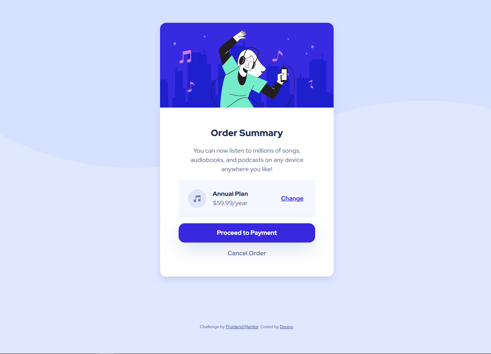

# Frontend Mentor - Order summary card solution

This is a solution to the [Order summary card challenge on Frontend Mentor](https://www.frontendmentor.io/challenges/order-summary-component-QlPmajDUj). Frontend Mentor challenges help you improve your coding skills by building realistic projects. 

## Table of contents

- [Overview](#overview)
  - [The challenge](#the-challenge)
  - [Screenshot](#screenshot)
  - [Links](#links)
- [My process](#my-process)
  - [Built with](#built-with)
  - [What I learned](#what-i-learned)
  - [Useful resources](#useful-resources)
- [Author](#author)

## Overview

### The challenge

Users should be able to:

- See hover states for interactive elements

### Screenshot
<h3>Mobile view</h3>

<h3>Desktop view</h3>

### Links

- Live URL: [Live Web Demo](https://douoo.github.io/frontendmentor_challenges/order-summary-component-main)
- Solution URL: [Src code](https://github.com/Douoo/frontendmentor_challenges/tree/main/order-summary-component-main)

## My process

### Built with

- Semantic HTML5 markup
- CSS custom properties
- Flexbox
- CSS Grid
- Mobile-first workflow

### What I learned

I practiced my CUBE css skill with this project. I kept my styling clean, modular and well organized 

### Useful resources

- [CUBE CSS Documentation](https://www.cube.fyi) - This helped me understand what CUBE is really about. It gave understanding on how I could keep my css organized in the form of composition, utility, block and exception.

## Author

- Frontend Mentor - [@Douoo](https://www.frontendmentor.io/profile/douoo)
- Instagram - [@Douoo](https://www.instagram.com/douooo/)

