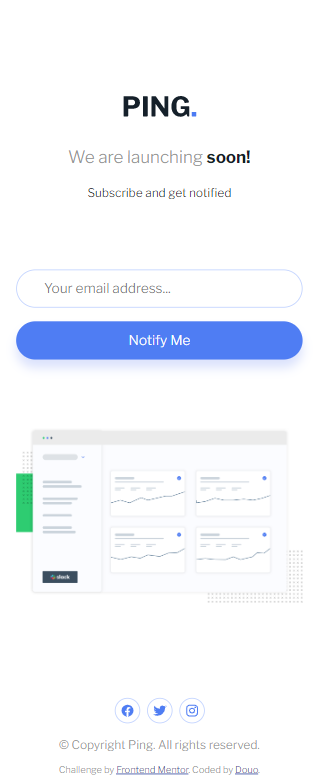
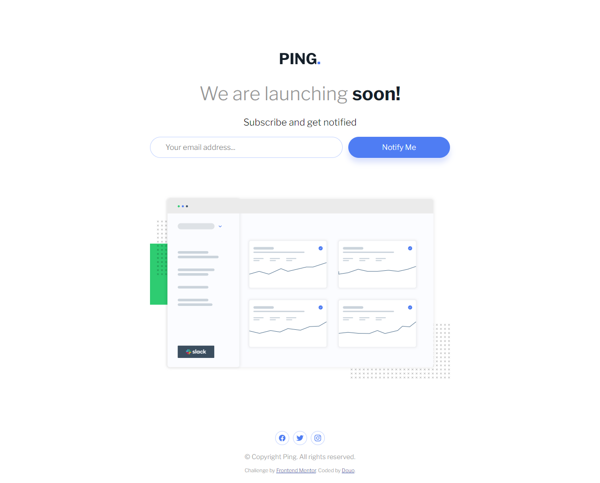

# Frontend Mentor - Ping coming soon page solution

This is a solution to the [Ping coming soon page challenge on Frontend Mentor](https://www.frontendmentor.io/challenges/ping-single-column-coming-soon-page-5cadd051fec04111f7b848da). Frontend Mentor challenges help you improve your coding skills by building realistic projects. 

## Table of contents

- [Overview](#overview)
  - [The challenge](#the-challenge)
  - [Screenshot](#screenshot)
  - [Links](#links)
- [My process](#my-process)
  - [Built with](#built-with)
  - [What I learned](#what-i-learned)
  - [Continued development](#continued-development)
  - [Useful resources](#useful-resources)
- [Author](#author)
- [Acknowledgments](#acknowledgments)

**Note: Delete this note and update the table of contents based on what sections you keep.**

## Overview

### The challenge

Users should be able to:

- View the optimal layout for the site depending on their device's screen size
- See hover states for all interactive elements on the page
- Submit their email address using an `input` field
- Receive an error message when the `form` is submitted if:
	- The `input` field is empty. The message for this error should say *"Whoops! It looks like you forgot to add your email"*
	- The email address is not formatted correctly (i.e. a correct email address should have this structure: `name@host.tld`). The message for this error should say *"Please provide a valid email address"*

### Screenshot




### Links


- Live Site URL: [Live site DEMO](https://douoo.github.io/frontendmentor_challenges/ping-coming-soon-page-master/)
- Solution URL: [Source code](https://github.com/Douoo/frontendmentor_challenges/tree/main/ping-coming-soon-page-master)
## My process

### Built with

- Semantic HTML5 markup
- CSS custom properties
- Flexbox
- CSS Grid
- Mobile-first workflow
- Vanilla JS

### What I learned

This was a similar challenge to the one I've worked before but I wanted to try domething different. I wanted to do form-validation in a different manner rather than writing a custom JS code (which I usually do).  In this challenge, I decided to learn how to do form validation the proper way, and it took a bit of experimentation. The main take away is learning how to use the proper build-in form validations and using :invalid and :valid with :not(:focus) and not(:placeholder-shown)

To see how you can add code snippets, see below:

```html
<input type="email" id="email" required>
```
```css
input:not(:focus):not(:placeholder-shown) {
  border-color: red;
}
```
```js
input.addEventListener('invalid', (event)=>{
	event.preventDefault();
	if(event.target.validity.valueMissing){
		//notify the user that the input field is required
	}else if (event.target.validity.patternMismatch){
		//notify the user that the input doesn't match with the required pattern and therefore is not valid
	}
})
```


**Note: Delete this note and the content within this section and replace with your own learnings.**

### Continued development

After learning how to do proper client side validation, I may need to go back to my other apps and implement this as well.

### Useful resources

- [Form Validation with HTML and CSS](https://www.bram.us/2021/01/28/form-validation-you-want-notfocusinvalid-not-invalid/) - An excellent resource as its clear, beginner friendly and to the point.
- [Client side form validation by MDN (Mozilla Developer)](https://developer.mozilla.org/en-US/docs/Learn/Forms/Form_validation#validating_forms_using_javascript) - I started with this article, which was super useful in understanding the proper form validation.


## Author

- Frontend Mentor - [@Douoo](https://www.frontendmentor.io/profile/douoo)
- Instagram - [@Douoo](https://www.instagram.com/douooo/)

## Acknowledgments

I would like to give my thanks to Mozilla Dev, and Bramus!
