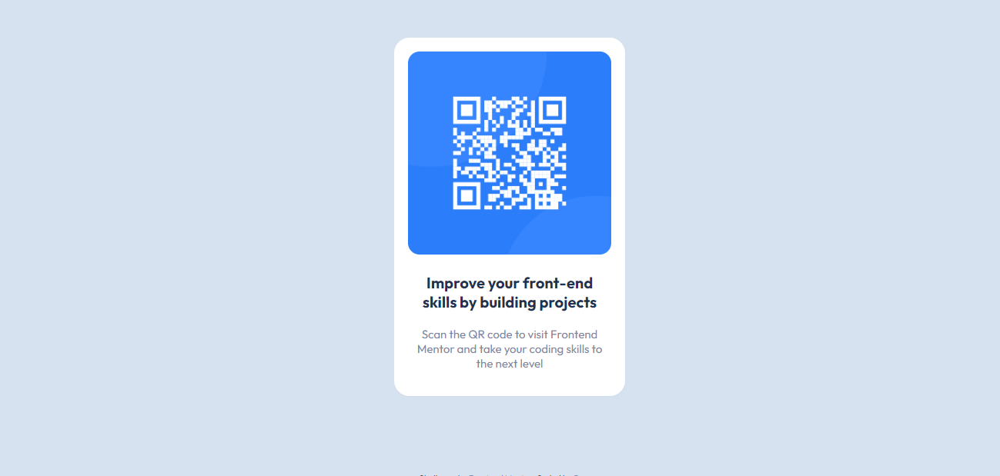

# Frontend Mentor - QR code component solution

This is a solution to the [QR code component challenge on Frontend Mentor](https://www.frontendmentor.io/challenges/qr-code-component-iux_sIO_H). Frontend Mentor challenges help you improve your coding skills by building realistic projects. 

## Table of contents

- [Overview](#overview)
  - [Screenshot](#screenshot)
  - [Links](#links)
- [My process](#my-process)
  - [Built with](#built-with)

## Overview

### Screenshot
Overview

### Links

- Solution URL: [Code](https://github.com/Douoo/frontendmentor_challenges/tree/main/qr-code-component-main)
- Live Site URL: [Preview](https://douoo.github.io/frontendmentor_challenges/qr-code-component-main)

## My process

### Built with

- Basic CSS and HTML5 markup
- Mobile-first workflow

