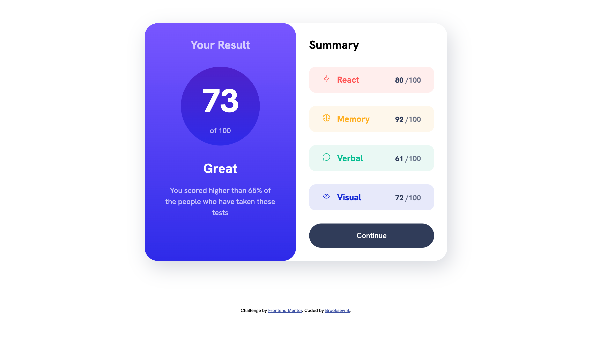

# Frontend Mentor - Results summary component solution

This is a solution to the [Results summary component challenge on Frontend Mentor](https://www.frontendmentor.io/challenges/results-summary-component-CE_K6s0maV). Frontend Mentor challenges help you improve your coding skills by building realistic projects. 

## Table of contents

- [Overview](#overview)
  - [The challenge](#the-challenge)
  - [Screenshot](#screenshot)
  - [Links](#links)
- [My process](#my-process)
  - [Built with](#built-with)
  - [What I learned](#what-i-learned)
  - [Continued development](#continued-development)
  - [Useful resources](#useful-resources)
- [Author](#author)
- [Acknowledgments](#acknowledgments)

**Note: Delete this note and update the table of contents based on what sections you keep.**

## Overview

### The challenge

Users should be able to:

- View the optimal layout for the interface depending on their device's screen size
- See hover and focus states for all interactive elements on the page

### Screenshot

<h3>Mobile screenshot</h3>

<h3>Desktop screenshot</h3>

### Links

- Solution URL: [Live Site](https://douoo.github.io/frontendmentor_challenges/results-summary-component-main/)
- Live Site URL: [Solution url](https://github.com/Douoo/frontendmentor_challenges/tree/main/results-summary-component-main)

## My process

### Built with

- Semantic HTML5 markup
- CSS custom properties
- Mobile-first workflow
- Flexbox
- CSS Grid

### What I learned

Its been a while since use basic HTML5 markup for building a website so I used this project as a warm up. The project was simple but reminded me of the basics of CSS.

### Continued development

I will be focusing on building websites using ReactJS after doing a couple of more projects using the basic HTML5. This will be an exciting journey I guess.

### Useful resources

- [Kevin Powell](https://github.com/kevin-powell/results-summary-component-main) - This helped me lot in organizing my colors accordingly. I can say my method before realizing this kind of color variable organization was not so good.

## Author

Lets connect

- GitHub Profile - [@Douoo](https://github.com/Douoo) 
- Frontend Mentor - [@Douoo](https://www.frontendmentor.io/profile/Douoo)
- Twitter - [@Douoo_B](https://twitter.com/Douoo_B)

## Acknowledgments

Much thanks to Kevin Powell