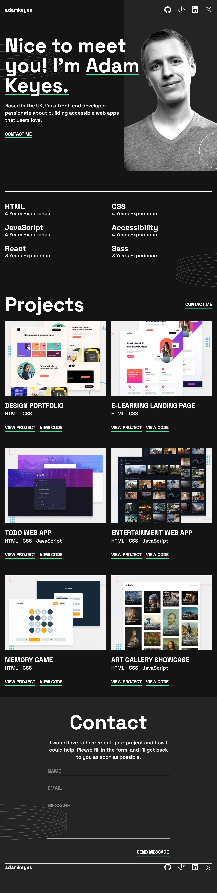

## Table of contents

- [Overview](#overview)
  - [The challenge](#the-challenge)
  - [Screenshot](#screenshot)
  - [Links](#links)
- [My process](#my-process)
  - [Built with](#built-with)
  - [What I learned](#what-i-learned)
  - [Continued development](#continued-development)
  - [Useful resources](#useful-resources)
- [Author](#author)

## Overview

### The challenge

Users should be able to:

- Receive an error message when the `form` is submitted if:
  - Any field is empty
  - The email address is not formatted correctly
- View the optimal layout for the interface depending on their device's screen size
- See hover and focus states for all interactive elements on the page
- **Bonus**: Hook the form up so it sends and stores the user's enquiry (you can use a spreadsheet or Airtable to save the enquiries)
- **Bonus**: Add your own details (image, skills, projects) to replace the ones in the design

### Screenshot

### Links

- Solution URL: [Live Site](https://douoo.github.io/frontendmentor_challenges/single-page-developer-portfolio/)
- Live Site URL: [Solution url](https://github.com/Douoo/frontendmentor_challenges/tree/main/single-page-developer-portfolio)

## My process

### Built with

- Semantic HTML5 markup
- CSS custom properties
- Flexbox
- CSS Grid
- Mobile-first workflow

### What I learned

Just flexed my CSS skills. 

### Continued development

I now realized the power of SASS and will no longer be writing my CSS from scratch. I will be making a common CSS library which I can use for most of upcoming projects

## Author

Lets connect

- GitHub Profile - [@Douoo](https://github.com/Douoo) 
- Frontend Mentor - [@Douoo](https://www.frontendmentor.io/profile/Douoo)
- Twitter - [@Douoo_B](https://twitter.com/Douoo_B)

