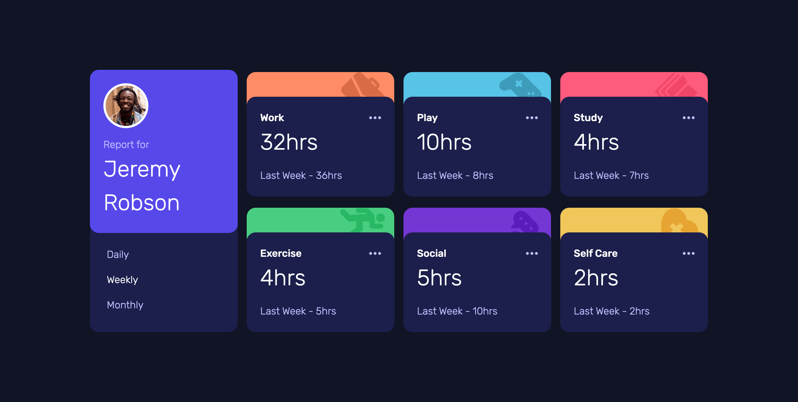
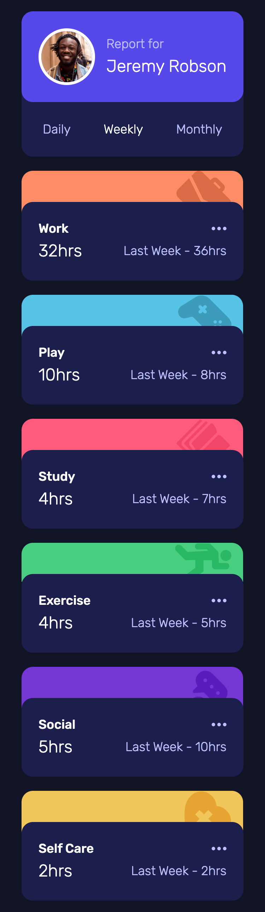

# Frontend Mentor - Time tracking dashboard solution

This is a solution to the [Time tracking dashboard challenge on Frontend Mentor](https://www.frontendmentor.io/challenges/time-tracking-dashboard-UIQ7167Jw). Frontend Mentor challenges help you improve your coding skills by building realistic projects. 

## Table of contents

- [Overview](#overview)
  - [The challenge](#the-challenge)
  - [Screenshot](#screenshot)
  - [Links](#links)
- [My process](#my-process)
  - [Built with](#built-with)
  - [What I learned](#what-i-learned)
  - [Continued development](#continued-development)
- [Author](#author)

## Overview

### The challenge

Users should be able to:

- View the optimal layout for the site depending on their device's screen size
- See hover states for all interactive elements on the page
- Switch between viewing Daily, Weekly, and Monthly stats

### Screenshot

#### Desktop screenshot

#### Mobile screenshot

### Links

- Solution URL: [Source code](https://github.com/douoo/frontendmentor_challenges/tree/main/time-tracking-dashboard)
- Live Site URL: [Preview](https://time-tracking-dashboard-five-pi.vercel.app/)

## My process

### Built with

- Semantic HTML5 markup
- CSS custom properties
- Flexbox
- CSS Grid
- Mobile-first workflow
- [React](https://reactjs.org/) - JS library
- React CSS Modules

### What I learned

This is the first time that I completed a challenge with ReactJS and seems like I have a lot to improve. I basically used useState, and useEffect as the main hooks for this project. I practiced my basic skills and will expect myself to improve on this.

### Continued development

I might have overkilled on making reusable components for this small project. I was in a mess and got lost at some point. I ended up having to track and re-adjust the components and its properties that were reusable. I hope to learn from my mistake from this project and improve on the next run.

## Author

- Frontend Mentor - [@Douoo](https://www.frontendmentor.io/profile/Douoo)
- Twitter - [@Douoo_B](https://twitter.com/Douoo_B)
- Instagram - [@Douoo](https://www.instagram.com/douooo/)

