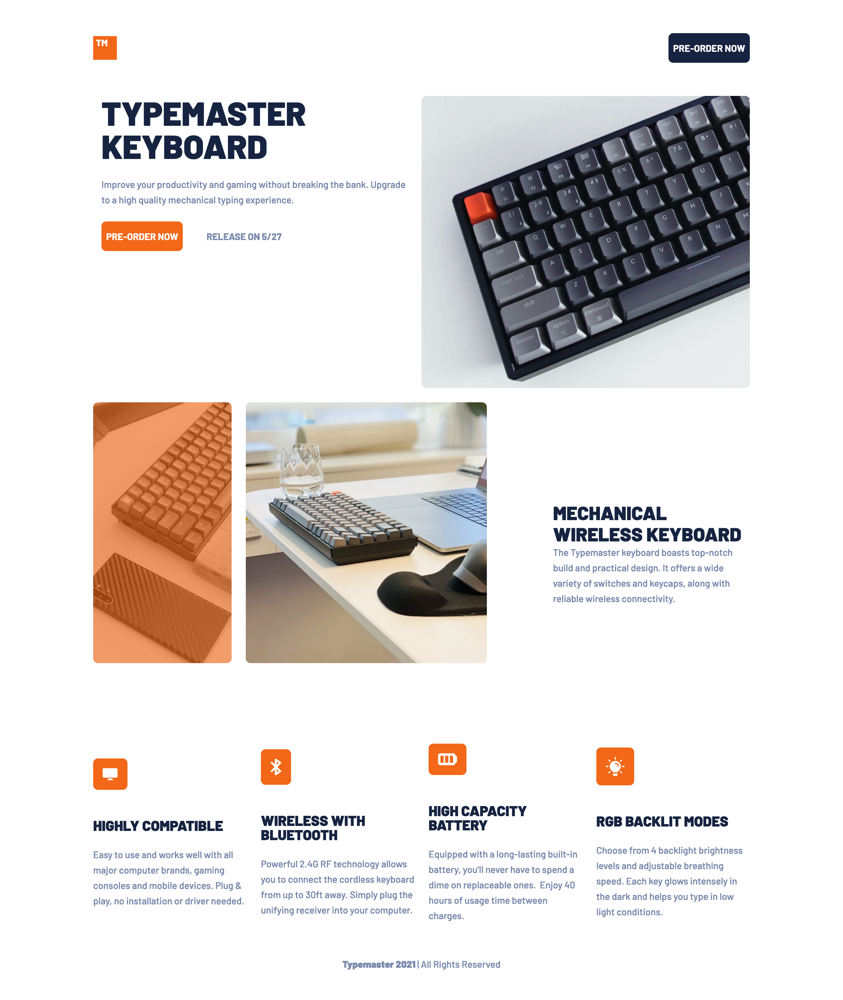

# Frontend Mentor - Typemaster pre-launch landing page solution

This is a solution to the [Typemaster pre-launch landing page challenge on Frontend Mentor](). Frontend Mentor challenges help you improve your coding skills by building realistic projects.

## Table of contents

- [Frontend Mentor - Typemaster pre-launch landing page solution](#frontend-mentor---typemaster-pre-launch-landing-page-solution)
  - [Table of contents](#table-of-contents)
  - [Overview](#overview)
    - [The challenge](#the-challenge)
    - [Screenshot](#screenshot)
    - [Links](#links)
  - [My process](#my-process)
    - [Built with](#built-with)
  - [Author](#author)

## Overview

### The challenge

Users should be able to:

-

### Screenshot

### Links

- Live Site URL: [Live Site](https://douoo.github.io/frontendmentor_challenges/typemaster-lp)
- Solution URL: [Solution url](https://github.com/Douoo/frontendmentor_challenges/tree/main/typemaster-lp)

## My process

### Built with

- Semantic HTML5 markup
- CSS custom properties
- Flexbox
- CSS Grid
- Mobile-first workflow

## Author

- GitHub Profile - [@Douoo](https://github.com/Douoo) 
- Frontend Mentor - [@Douoo](https://www.frontendmentor.io/profile/Douoo)
- Twitter - [@Douoo_B](https://twitter.com/Douoo_B)

