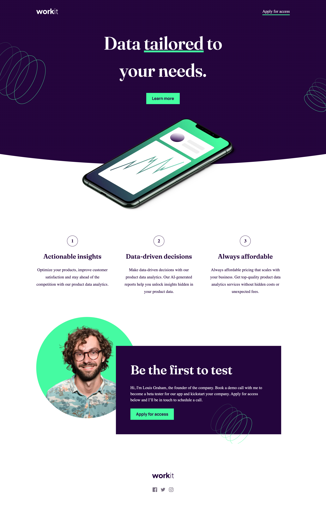

# Frontend Mentor - Workit landing page solution

This is a solution to the [Workit landing page challenge on Frontend Mentor](https://www.frontendmentor.io/challenges/workit-landing-page-2fYnyle5lu). Frontend Mentor challenges help you improve your coding skills by building realistic projects. 

## Table of contents

- [Overview](#overview)
  - [The challenge](#the-challenge)
  - [Screenshot](#screenshot)
  - [Links](#links)
- [My process](#my-process)
  - [Built with](#built-with)
  - [What I learned](#what-i-learned)
  - [Continued development](#continued-development)
  - [Useful resources](#useful-resources)
- [Author](#author)

**Note: Delete this note and update the table of contents based on what sections you keep.**

## Overview

### The challenge

Users should be able to:

- View the optimal layout for the interface depending on their device's screen size
- See hover and focus states for all interactive elements on the page

### Screenshot




### Links

- Solution URL: [Source code](https://douoo.github.io/frontendmentor_challenges/workit-landing-page/)
- Live Site URL: [Live site](https://github.com/Douoo/frontendmentor_challenges/tree/main/workit-landing-page)

## My process

### Built with

- Semantic HTML5 markup
- CSS custom properties
- Flexbox
- CSS Grid
- Mobile-first workflow


### What I learned

Learned how to create a curved element with border radius and the scale property. However, I can not say that the method I created is one that is efficient nor is it one that I plan to follow in the future.

```
    .element{
        position: relative;
    }

    .element::before {
        content: '';
        position: absolute;
        top: 0;
        left: 0;
        height: 100%;
        width: 100%;
        background: #000;
        transform: scaleX(2);
        border-radius: 0 0 50% 50%/0 0 50% 50%;
    }
```

### Continued development

The project overall is easy but I struggled heavily to create curved radius. I hope to learn more on how I can create custom curved shapes on div elements.

## Author

- GitHub Profile - [@Douoo](https://github.com/Douoo) 
- Frontend Mentor - [@Douoo](https://www.frontendmentor.io/profile/Douoo)
- Twitter - [@Douoo_B](https://twitter.com/Douoo_B)


